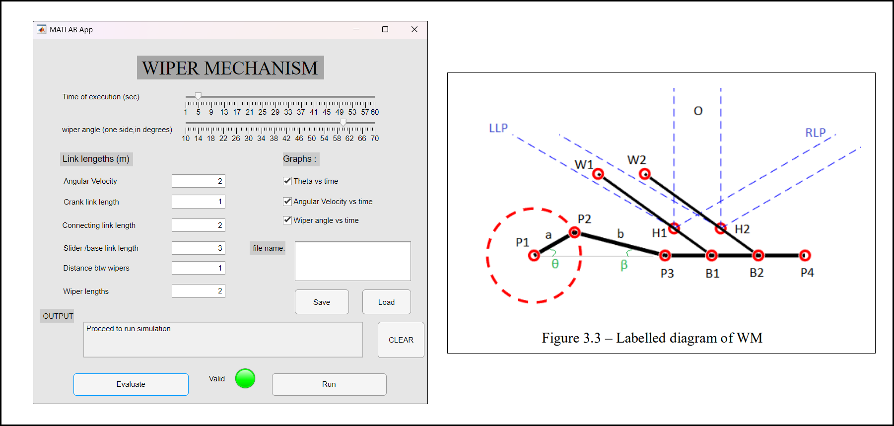

# four-bar-linkage-mechanism
## Wiper Mechanism model Application using Matlab

In this project, I built an application using the rudimentary physics of a **4 bar linkage mechanism**(specifically Slider-Crank mechanism) to create a manipulatable simulation of a wiper mechanism to visualize its functional components and perform practical analysis using Matlab. In our case the wiper mechanism 
is a "bottom-middle pivoted synchronous dual arm wiper".

> ! To be able to run the demo through the app the user is first required to evaluate the model parameters which are required to conform to the 
>>**Grashof's Law**. (== evaluate before run)

\

\
The features of this project are :
1. GUI
2. SIMULATION
3. ERROR HANDLING
4. MODEL SAVE
5. PLOTS

We use the general metrics to generate the following plots of the model,

\
This project allowed me to experience the empirical process of full-scale product/model development.

## Documentation

The Documentation of this project can be found [Click here](Report.pdf)

  
## Run Locally

The MATLAB code file and application can be downloaded from [Here](Wiper_Mechanism.mlapp)

Prerequisites

MATLAB version with Appdesigner (project was created in MATLAB 9.9 / R2020b)

You will also require the Image processing toolbox

[download here](https://in.mathworks.com/downloads/web_downloads/)
